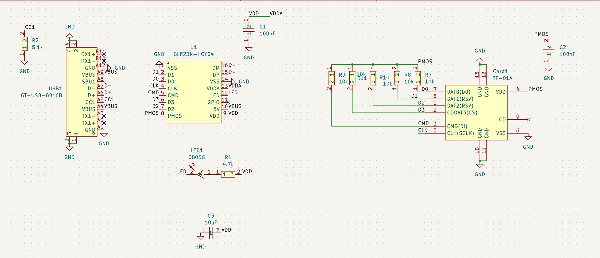
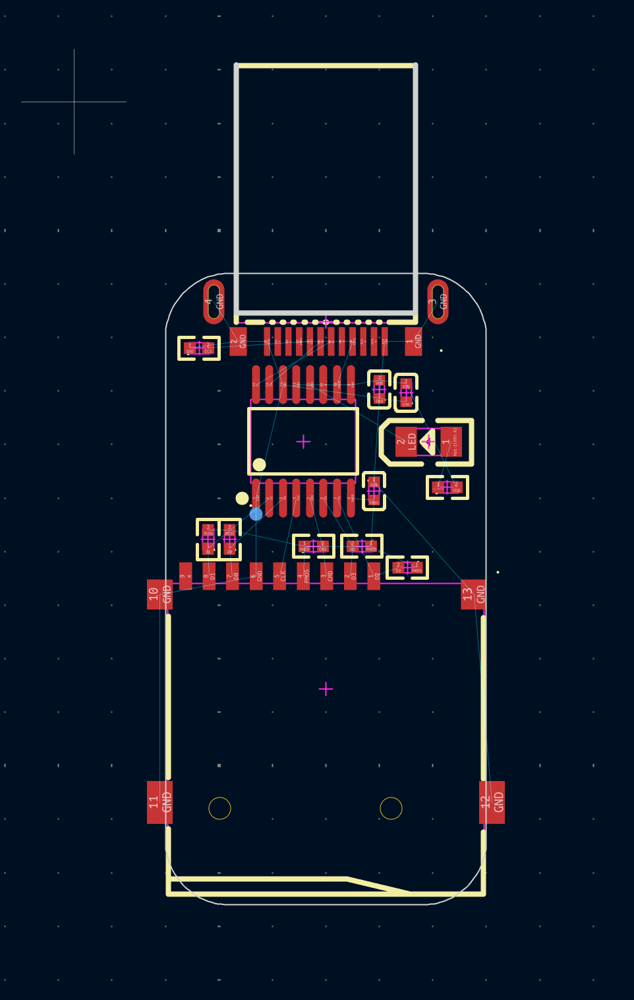

# 25 August

Had this idea, did some research, and made the schematic super duper quickly.

Pinout is mostly self-explanatory, also found a sus reference design off of eeworld but its pretty sus bc they dont have pullups on the SD data lines. not sure if I should trust their cap values but they look plausible I guess lol. Also wanted to double check my LED direction with it

Time spent: 0.6 hours

# 25 August

Simple layout done

tbd if the top usb bit is routable, but the SD is.

Time spent: 0.25 hours
