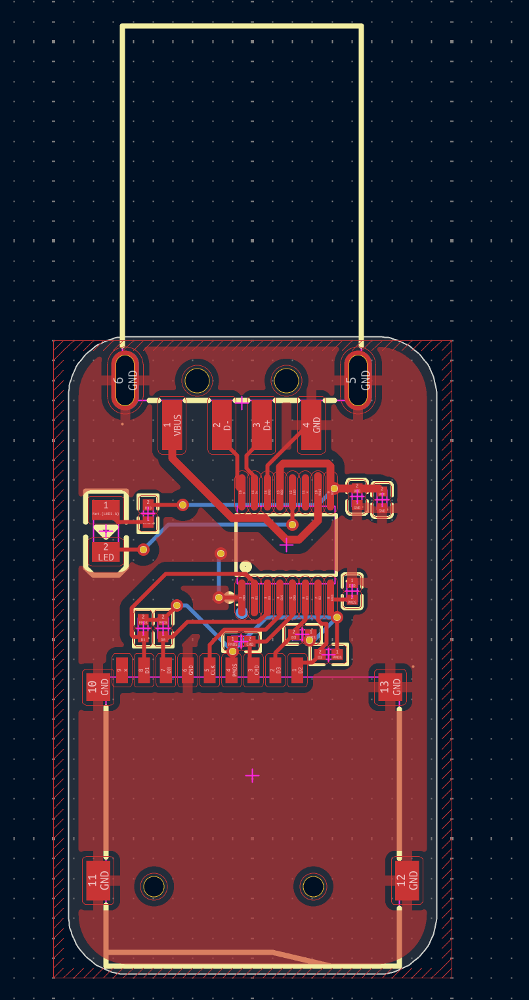
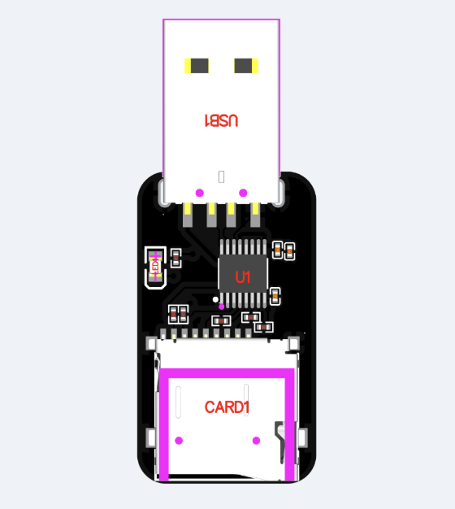
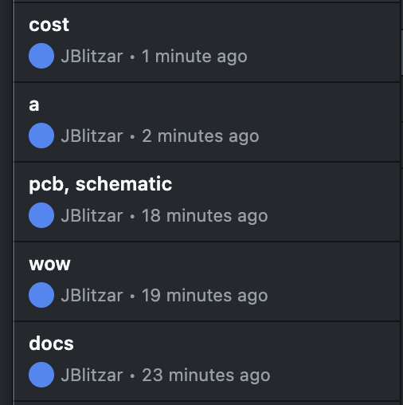

# 25 August

Had this idea, did some research, and made the schematic super duper quickly.

Pinout is mostly self-explanatory, also found a sus reference design off of eeworld but its pretty sus bc they dont have pullups on the SD data lines. not sure if I should trust their cap values but they look plausible I guess lol. Also wanted to double check my LED direction with it

Time spent: 0.6 hours

# 25 August

Simple layout done

tbd if the top usb bit is routable, but the SD is.

Time spent: 0.25 hours

# 26 August

Routed it, swapped to USB A because there are no good USB C male connectors. Use a dongle. It's okay.

Time spent: 0.2 hours

## 26 August

Got a quote and got the BOM. Had to rotate one thing.

I hope $29 is acceptable....

Time spent: 0.2 hours

## 26 August

Final touches. I did some stuff on the silkscreen (added my name and #dongle), re-exported everything, made a blender render (had to tweak compositing), re-quoted on JLCONE, and did a pass on the README! Finally the grand total is under $20 (barely lol) yayayayay!!

Investigated using an edge connector but it's not worth it. Worse fit, need to pay $30 more or do a case, etc etc. 

I think I'm ready to submit!

Time spent: 0.3 hours

## 26 August

Emergency addition of 47uF cap as per peer advice. Eliminated the 100uF in tandem ([1](https://www.signalintegrityjournal.com/articles/1589-the-myth-of-three-capacitor-values))

Re-exported. Assumed the quote is $0.33 more all the way through after clicking through a bit. 19.79 still gets me barely under $20 !!

Time spent: 0.2 hours
