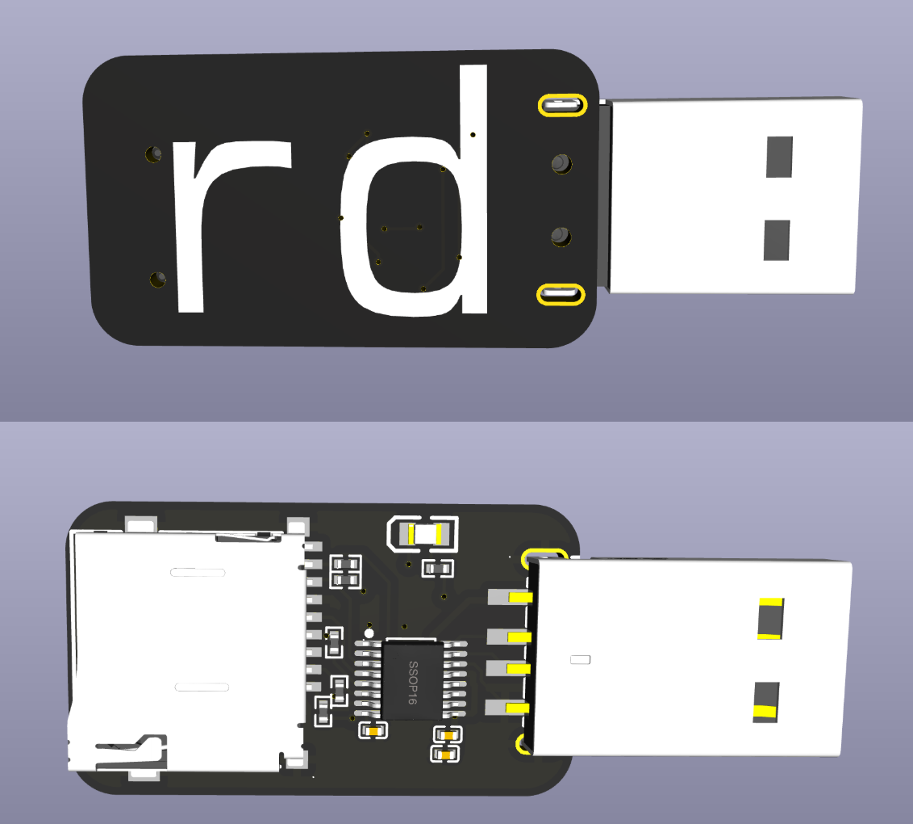

# rd

microSD card reader. A really simple one, using GL823K.

Supports USB 2.0 HS and microSD HS. This is well-matched, it pretty much saturates the USB2.0 link.

I made this project because I needed a project scoped to be able to speedrun in 36 hours wall-clock and very little actual working time. It grants me utility-- this way I can read and write to microSD cards super easily, using a dongle I created!! I think microSD cards are uniquely very versatile. It unlocks a new ASIC for me that I haven't used before.  

## Schematic

## PCB

## Production outputs like gerbers

Find them in [PCB/rd/production](PCB/rd/production)!

## BOM

|Item         |Cost |Notes                                                                   |
|-------------|-----|------------------------------------------------------------------------|
|5x PCB (MOQ) |2.1  |order off of JLCONE desktop to save two dollars instead of it costing $4|
|2x PCBA (MOQ)|23.82|                                                                        |
|Shipping     |3.3  |Shipping special offer, otherwise costs 7                               |
|Total        |29.22|                                                                        |
