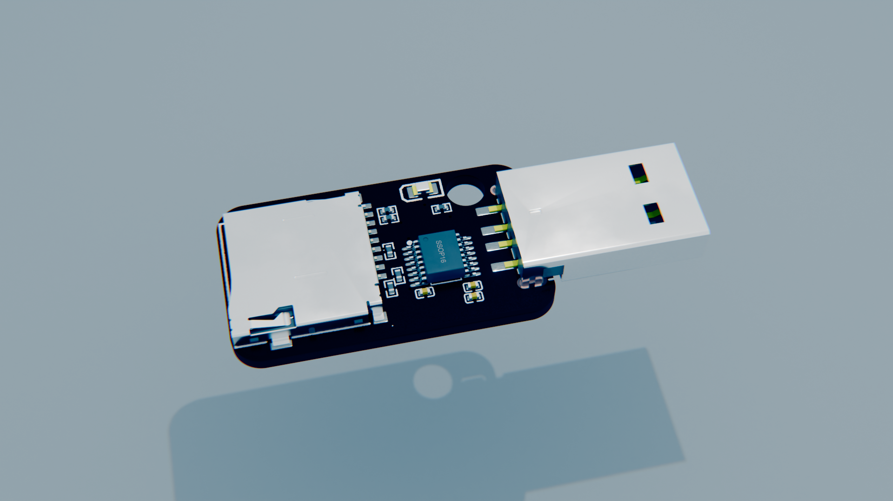
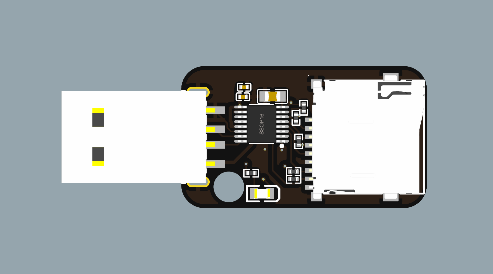
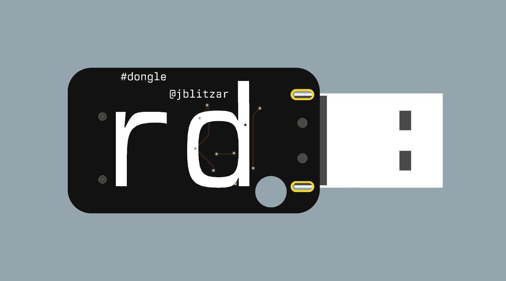
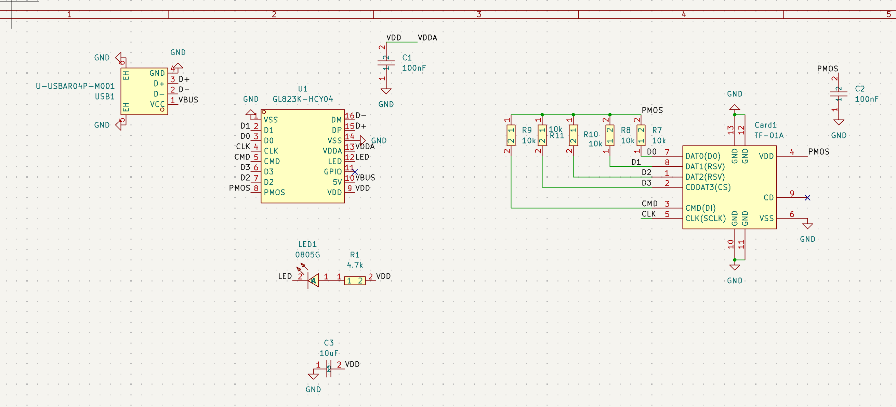
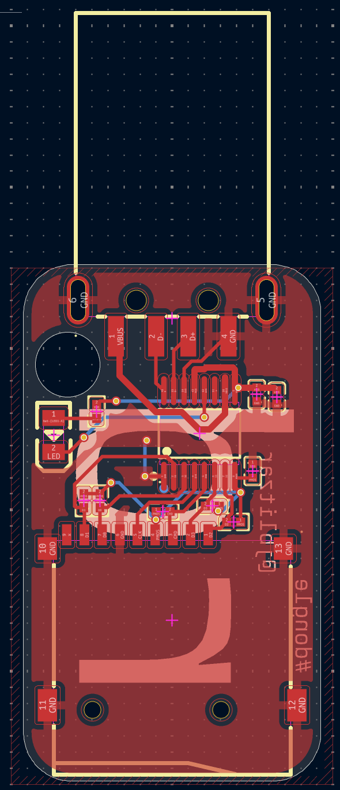
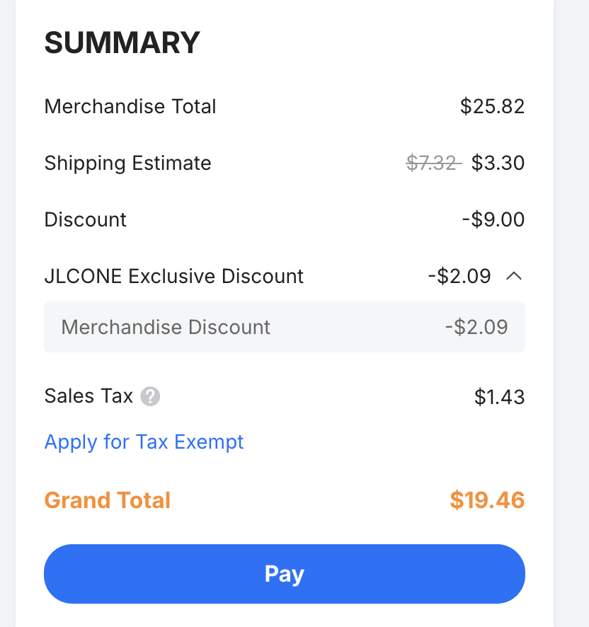

# rd

microSD card reader. it exposes microSD cards as a block device that you can read and write to!

Features:
 - dead-simple schematic thanks to the GL823K chip
 - green status LED for activity
 - 4mm keychain hole
 - supports USB 2.0 HS and microSD HS. This means up to 25 MB/s ! 

I made this project because I needed a project scoped to be able to speedrun in 36 hours wall-clock and very little actual working time. It grants me utility-- this way I can read and write to microSD cards super easily in a small form factor, using a dongle I created!! I think microSD cards are uniquely very versatile. There are ones with industrially-rated durability. There are ones that go up to 2TB. There are ones that are so dirt-cheap they cost only a little bit more than the raw NAND inside them. Also, this project unlocks a new ASIC for me that I haven't used before.  

|       |  |
| ----------- | ----------- |
|       |  |

## Schematic

## PCB

## Production outputs like gerbers

Find them in [PCB/rd/production](PCB/rd/production)!

## BOM

Order by uploading the fabrication outputs (linked above) to jlcpcb!

|Item         |Cost |Notes                                                                   |
|-------------|-----|------------------------------------------------------------------------|
|5x PCB (MOQ) |2.0  |order off of JLCONE desktop to save two dollars instead of it costing $4|
|2x PCBA (MOQ)|23.82|                                                                        |
|Shipping     |3.3  |Shipping special offer, otherwise costs 7                               |
|Total        |29.12|                                                                        |

NOTE: I have the $9 PCBA special offer, a $2.09 JLC exclusive discount, and +$1.43 sales tax. My grand total is $19.46

